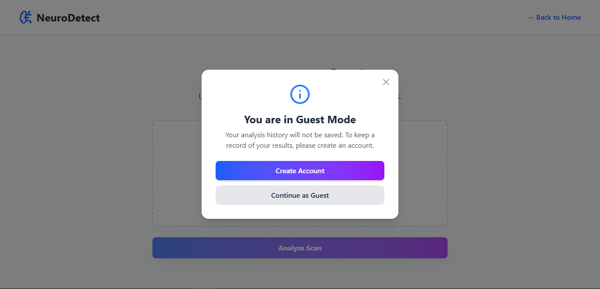

# NeuroDetectAI
NeuroDetectAI is a web application that provides an AI-powered detection tool for brain tumors. The application uses a deep learning model to analyze user-uploaded MRI images of the brain and provides a classification, along with user authentication and a dashboard to view detection history.

---

## Features
* **AI-Powered Detection**: The application utilizes a custom Convolutional Neural Network (CNN) model built with TensorFlow/Keras to classify brain MRI images into four categories: `pituitary`, `notumor`, `glioma`, and `meningioma`.
* **Secure User Authentication**: Complete user management system with signup, login, and email verification.
* **Interactive Dashboard**: A user-friendly dashboard to manage your profile and view detection history.
* **Guest Mode**: The ability to try the detection model without creating an account.

---

## Model, Accuracy & Dataset
The core of this project is a Convolutional Neural Network (CNN) fine-tuned for brain tumor classification.
* **Model**: The model is a custom CNN model built using the TensorFlow and Keras libraries.
* **Dataset**: The model was trained on the "Brain Tumor MRI Dataset" available on Kaggle. You can find it here: [https://www.kaggle.com/datasets/masoudnickparvar/brain-tumor-mri-dataset](https://www.kaggle.com/datasets/masoudnickparvar/brain-tumor-mri-dataset)
* **Detected Conditions**: The model is trained to identify the following conditions:
    1.  Pituitary
    2.  No tumor detected
    3.  Glioma
    4.  Meningioma

---

## Technology Stack
* **Frontend**: React JS
* **Backend**: FastAPI (Python)
* **Machine Learning**: TensorFlow / Keras
* **Database**: MongoDB

---

## 📸 Application Screenshots

### Homepage Layouts
| Home | Get Started |
| :--- | :--- |
|  |  |

### Guest Views
| Guest Mode | Guest Mode with Glioma Result | Guest Mode with Meningioma Result | Guest Mode with Pituitary Result | Guest Mode with No Tumor Result |
| :--- | :--- | :--- | :--- | :--- |
|  |  |  |  |  |

### Authentication Flow
| Register Page | Login Page | Email Verification | Verification Successful | Verification Failed |
| :--- | :--- | :--- | :--- | :--- |
|  |  |  |  |  |

### Dashboard
| Dashboard with Results | Dashboard with Logout Option |
| :--- | :--- |
|  |  |

---

## 🚀 Installation and Setup
To get a local copy up and running, follow these steps. This project is split into a `backend` and `frontend` directory.

### Prerequisites
* Python 3.8+
* Node.js v14+
* NPM or Yarn

### 1. Clone the Repository
```bash
git clone https://github.com/MHuzaifaHussain/NeuroDetectAI.git
cd NeuroDetectAI
```
### 2. Frontend Setup (React)
```bash
# Navigate to the frontend directory from the root folder
cd Frontend/brain-tumor-mri-frontend

# Install NPM packages
npm install

# Start the application
npm run dev
```
The React development server will open at http://localhost:5173.

### 3. Backend Setup (FastAPI)
```bash
# Navigate to the backend directory
cd Backend

# Create a virtual environment
python -m venv venv
source venv/bin/activate  # On Windows use `venv\Scripts\activate`

# Install required Python packages
pip install -r requirements.txt

# Run the backend server
uvicorn app.main:app --reload
```
The backend API will be running on http://127.0.0.1:8000.

### 4. Running the Application
After the initial setup is complete (cloning, virtual environment, and node modules installation), you can easily run the application using the Run.cmd file.
```bash
# From the root directory of the project
./Run.cmd
```
This will start both the frontend and backend servers.